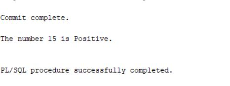
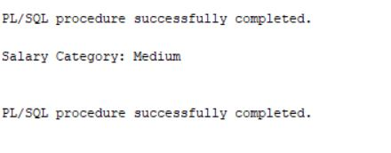
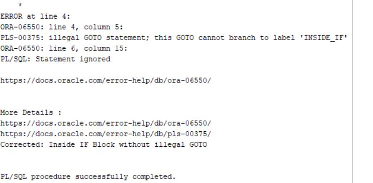
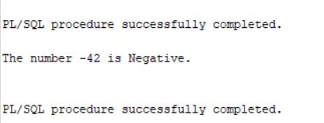

# PL/SQL Control Structures and Stored Functions Project

**Course:** Database Development (INSY 8311)  
**Student Name:**  Sifa Sonia Chanisse  
**Student ID:** 20251SEN191  
**Database Service:** `so_pdb_20251sen191` (Oracle 21c)  
**Repository Name:** `plsql-goto-functions-20251SEN191-Sonia`  


## 📌 Project Overview
This repository contains the implementation and testing of PL/SQL programs demonstrating control structures, unconditional branching using `GOTO` statements, custom stored functions, exception handling, and database integration for payroll validation.


## 📁 Repository Directory Structure

```text
plsql-goto-functions-20251SEN191-Sonia/
│
├── 00_setup/
│   └── create_tables.sql         # Schema creation and sample data population
│
├── 01_goto/
│   ├── A1_number_classifier.sql  # Classifies positive, negative, or zero using GOTO
│   ├── A2_salary_review.sql      # Categorizes salary levels using GOTO
│   ├── A3_illegal_goto.sql       # Demonstrates illegal GOTO error (PLS-00375) and fix
│   └── A4_rewrite_no_goto.sql    # Refactored A1 logic without GOTO statements
│
├── 02_functions/
│   ├── B1_fn_annual_salary.sql   # Computes annual salary from monthly input
│   ├── B2_fn_years_of_service.sql# Calculates full years of service from hire date
│   ├── B3_fn_calculate_tax.sql   # Determines annual tax rate tier
│   ├── B4_fn_dept_name.sql       # Fetches department name with exception handling
│   └── C1_fn_validate_payroll.sql# Validates employee payroll record with user exceptions
│
├── 03_tests/
│   ├── B5_functions_in_select.sql# Query invoking Part B functions across employees
│   └── test_validate_payroll.sql # Block testing C1 payroll validator edge cases
│
├── screenshots/
│   ├── A1_output.png             # Task A1 execution output
│   ├── A2_output.png             # Task A2 execution output
│   ├── A3_error_and_fix.png      # Task A3 illegal GOTO error & fix demonstration
│   ├── A4_output.png             # Task A4 refactored execution output
│   ├── B5_select_output.png      # Task B5 SQL SELECT query results grid
│   └── C1_output.png             # Task C1 Payroll Validation execution output
│
└── README.md                     # Project documentation
```


## 📝 Section Summaries & Screenshots

### Part A: Control Structures & GOTO Demonstration
* **Task A1 (`A1_number_classifier.sql`):** Uses conditional logic and `GOTO` labels to classify input numbers as positive, negative, or zero.
* **Task A2 (`A2_salary_review.sql`):** Evaluates salary ranges using branching logic to print income tier categories.
* **Task A3 (`A3_illegal_goto.sql`):** Demonstrates Oracle error `PLS-00375: illegal GOTO statement` when branching directly into an `IF` block from outside, followed by the corrected implementation.
* **Task A4 (`A4_rewrite_no_goto.sql`):** Refactors Task A1 into modern, structured `IF-ELSIF-ELSE` blocks without `GOTO` statements.

#### Screenshots — Part A:
| Task | Description | Screenshot |
| :--- | :--- | :--- |
| **A1** | Number Classifier Output |  |
| **A2** | Salary Review Output |  |
| **A3** | Illegal GOTO Error & Correction |  |
| **A4** | Refactored Logic Output |  |

---

### Part B: Stored Functions & Data Integration
* **`fn_annual_salary`:** Multiplies valid monthly salary by 12 (returns `0` for invalid/negative values).
* **`fn_years_of_service`:** Uses `MONTHS_BETWEEN` and `TRUNC` to return completed years of service.
* **`fn_calculate_tax`:** Applies progressive tax brackets (10%, 20%, 30%) based on annual earnings.
* **`fn_dept_name`:** Queries `departments` table with `NO_DATA_FOUND` exception safety.
* **Task B5 (`B5_functions_in_select.sql`):** Integrates all Part B functions inside a single `SELECT` statement querying the `employees` table.

#### Screenshots — Part B:
| Task | Description | Screenshot Link |
| :--- | :--- | :--- |
| **B5** | Multi-function SQL Query Result Grid | [B5_select_output.jpg](screenshots/B5_select_output.JPG) |

---

### Part C: Business Logic & Payroll Validation
* **`fn_validate_payroll`:** Validates employee records before processing payroll. Raises user-defined exceptions (`ex_invalid_salary`, `ex_future_hire`) and returns `VALID` or structured failure reason strings.

#### Screenshots — Part C:
| Task | Description | Screenshot Link |
| :--- | :--- | :--- |
| **C1** | Payroll Validation Test Output | [C1_output.jpg](screenshots/C1_output.JPG) |

---

## 🚀 Execution Instructions (Oracle SQL Developer)

1. Connect to the PDB service **`so_pdb_20251sen191`**.
2. Run `00_setup/create_tables.sql` using **`F5`** to initialize tables and insert initial records.
3. Compile all stored functions under `02_functions/`.
4. Enable server output (`SET SERVEROUTPUT ON;`) and execute test scripts under `01_goto/` and `03_tests/`.
